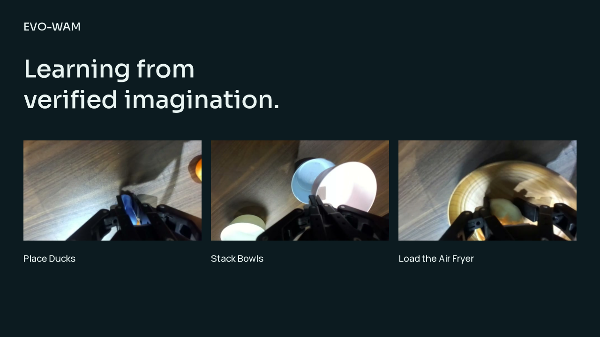
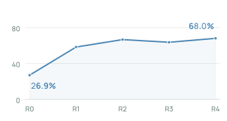
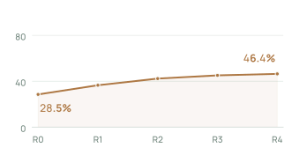
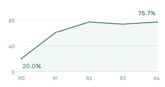
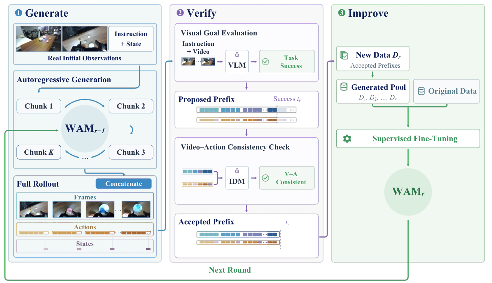

<div align="center">

# EVO-WAM: Evolving World Action Models through Video-Action Verification

Shiyang Zhou<sup>1,2,‡</sup>, Xionghao Wu<sup>3,‡</sup>, Wenbo Li<sup>4,†</sup>, Shenghe Zheng<sup>5</sup>, Jiyao Zhang<sup>6</sup>, Songsong Yu<sup>7</sup>, Yijun Yang<sup>5,8</sup>, Jianhui Liu<sup>9</sup>, Haoze Sun<sup>10</sup>, Senqiao Yang<sup>11</sup>, Li Jiang<sup>12,2</sup>, Jingyong Su<sup>1</sup>, Haoyang Huang<sup>4</sup>, Zhuotao Tian<sup>1,2,&#42;</sup>

<sup>1</sup>HITSZ · <sup>2</sup>SLAI · <sup>3</sup>THU · <sup>4</sup>JD · <sup>5</sup>HKUST · <sup>6</sup>PKU · <sup>7</sup>SJTU · <sup>8</sup>HKUSTGZ · <sup>9</sup>HKU · <sup>10</sup>UBC · <sup>11</sup>CUHK · <sup>12</sup>CUHKSZ

‡ Equal contribution · † Project lead · &#42; Corresponding author

[](https://arxiv.org/abs/2609.38057)
[](https://evo-wam.github.io/)
[](https://evo-wam.github.io/#overview)

**Code to be released.**

</div>

## 🎬 Demo

[](https://evo-wam.github.io/#overview)

[Watch the demo](https://evo-wam.github.io/#overview) · [Video file](https://evo-wam.github.io/assets/videos/overview.mp4) · [Before / after comparisons](https://evo-wam.github.io/#experiments)

## ✨ Highlights

- **Learn from generated experience.** EVO-WAM improves world action models using their own generated video–action trajectories, without additional expert demonstrations or external execution of candidate actions during self-training.
- **Verify before training.** Visual checks assess task completion and consistency; inverse dynamics checks whether the generated actions agree with the generated video. Verified prefixes are accumulated and mixed with the original training data.
- **Improve in simulation and on real robots.** Across four self-evolution rounds, Cosmos3 improves from **26.9% to 68.0%** on seven unseen RoboTwin 2.0 tasks and from **20.0% to 76.7%** on three unseen real-robot composite tasks. DreamZero improves from **28.5% to 46.4%** in simulation.

## 📊 Results

Mean task success (%) from R0 to R4. Gains are in percentage points.

| | Cosmos3 · Simulation | DreamZero · Simulation | Cosmos3 · Real world |
|:--|:--:|:--:|:--:|
| Success | 26.9 → **68.0** | 28.5 → **46.4** | 20.0 → **76.7** |
| Gain | **+41.1** | **+17.9** | **+56.7** |
| Tasks | 7 unseen RoboTwin 2.0 tasks | 7 unseen RoboTwin 2.0 tasks | 3 unseen long-horizon composite tasks |
| Rounds |  |  |  |

### Robot demonstrations

The [interactive gallery](https://evo-wam.github.io/#experiments) compares earlier and updated policies on six tasks:

- **Real world:** Place Ducks, Load the Air Fryer, and Stack Bowls.
- **Simulation:** Stack Three Blocks, Place Cup on Coaster, and Place Bread in Basket.

Simulation comparisons use the same initial scene and instruction. Real-robot videos show separate trials with similar layouts, with inference pauses removed; the updated Stack Bowls instruction explicitly asks to lift both bowls together. Policy rounds are labeled in the gallery.

## 🧩 Method



1. **Imagine:** generate video–action trajectories for a target task.
2. **Verify:** screen visual consistency, check action reconstruction with an inverse dynamics model, and confirm subgoal endpoints with VLM votes.
3. **Improve:** accumulate verified prefixes across tasks and rounds, mix them with the original data, and fine-tune the world action model for the next round.

[Explore the four demo candidates and verification evidence](https://evo-wam.github.io/#method).

## 📧 Contact

For questions about EVO-WAM, contact **Shiyang Zhou** at [shiyangzhou@stu.hit.edu.cn](mailto:shiyangzhou@stu.hit.edu.cn).

Project lead: **Wenbo Li** · [fenglinglwb@gmail.com](mailto:fenglinglwb@gmail.com)  
Corresponding author: **Zhuotao Tian** · [tianzhuotao@hit.edu.cn](mailto:tianzhuotao@hit.edu.cn)

## 📝 Citation

If you find EVO-WAM useful in your research, please cite:

```bibtex
@misc{zhou2026evowamevolvingworldaction,
      title={EVO-WAM: Evolving World Action Models through Video-Action Verification},
      author={Shiyang Zhou and Xionghao Wu and Wenbo Li and Shenghe Zheng and Jiyao Zhang and Songsong Yu and Yijun Yang and Jianhui Liu and Haoze Sun and Senqiao Yang and Li Jiang and Jingyong Su and Haoyang Huang and Zhuotao Tian},
      year={2026},
      eprint={2609.38057},
      archivePrefix={arXiv},
      primaryClass={cs.CV},
      url={https://arxiv.org/abs/2609.38057},
}
```

[Download BibTeX](citation.bib)
